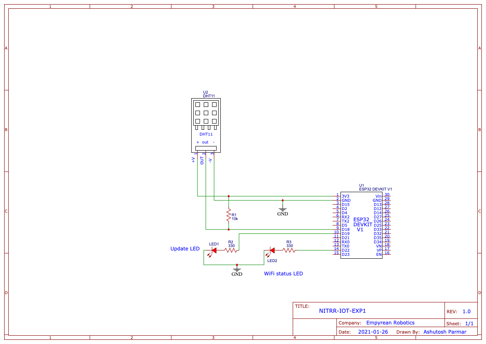

> In this experiment we will use DHT11 sensor with esp32 development board to periodically send temperature data to a thingspeak channel ( thingspeak is a free Internet of Things Cloud ). This data can be processed to extract useful information.

### You will need following components to perform this experiment -

1. ESP32 development board - x1.
2. DHT11 temperature/humidity sensor - x1.
3. LED of any color - x2.
4. Breadboard - x1.
5. USB 2 standard type A to USB 2 micro type B cable - x1.
6. 10k resistor - x1.
7. 330 ohm resistor - x2.
8. Male to Male jumper cable = x6.

### You will need following software / accounts to perform this experiment -

1. Arduino IDE - https://www.arduino.cc/en/software
2. Thingspeak Account - [thingspeak guide](/thingspeak.md)

### Pinout for sensor module and ESP32 development board -

##### ESP32 development board pinout ( image source - https://circuits4you.com )

##### DHT11 temperature, humidity sensor pinout

### Connection diagram / schematic - 

### Instructions -

1. Login to your thingpspeak account and select a channel, field which you want the temperature data to be sent to.
2. Note down the API keys.

> For next steps you must have Arduino IDE installed, configured for ESP32 development board. You will also need to install the 'DHTesp' library before moving ahead. Here's a good tutorial on how to setup Arduino IDE for ESP32 development boards - https://randomnerdtutorials.com/installing-the-esp32-board-in-arduino-ide-windows-instructions/ 

3.  Download the attached source code and open it with Arduino IDE.
4.  Thoroughly study the source code and edit the WiFi credentials (line 63, line 64) and API URL (line 116).
5.  Compile the source code and check for errors (if any).
6.  Connect your ESP32 development board to you computer using the USB cable.
7.  Obtain the port number assigned to your development board __(this step varies with operating system)__.
8.  In Arduino IDE go to __Tools > Board > ESP32 Arduino__ and select __DOIT ESP32 DEVKIT V1__.
9.  In Arduino IDE go to __Tools > Board > Port__ and select __{COM port identified in step 7}__.
10. Upload the code to your development board.

### Testing - 

1. Now power your system using the USB cable. Make sure that the system is close to the WiFi access point. You may choose to power the system with a 5v adapter should you plan to run for long period of time.
2. Once connected, __the WiFi status LED__ will light up indicating the same. Consequently, the system will try to send the temperature reading to thingspeak channel and go back to sleep. If data is sent successfully the __Update status LED__ will blink rapidly for 5 times indicating the same.
3. You can view the temperature data on you thingspeak channel dashboard.
4. Your may edit the sleep period (line 112). The System will periodically wake up and try to connect to the access point and send the data to thingspeak channel.

